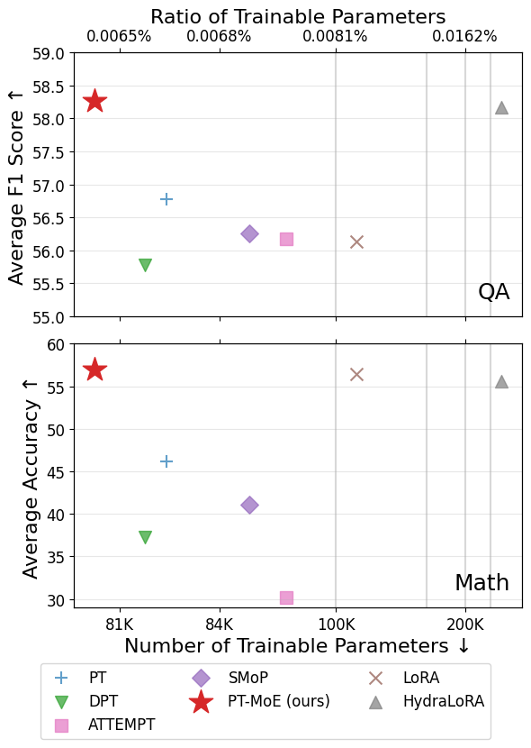
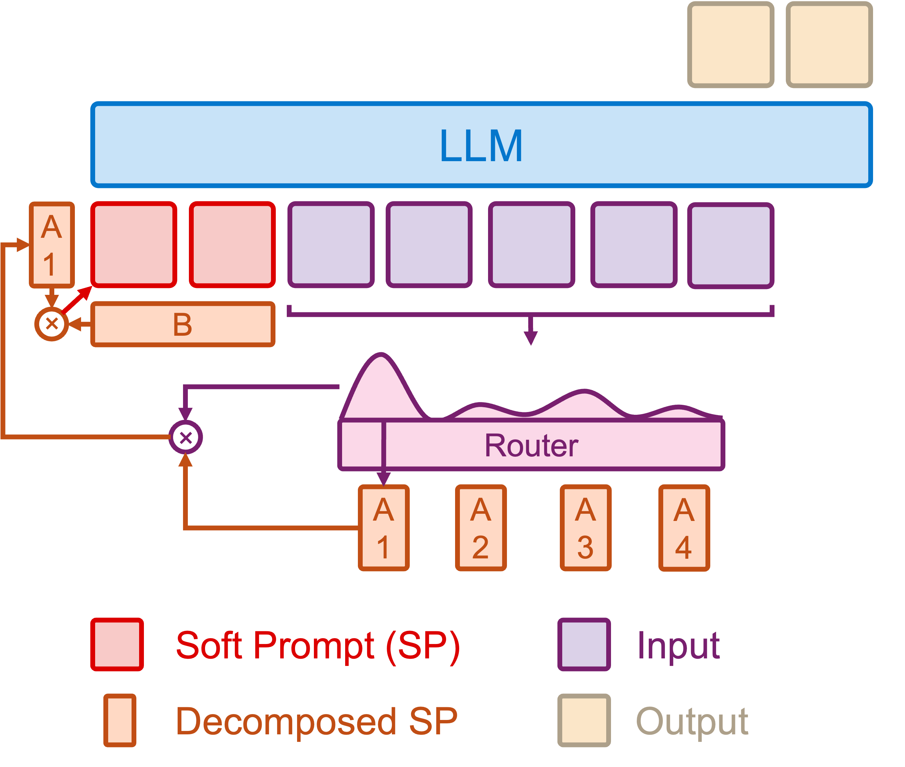
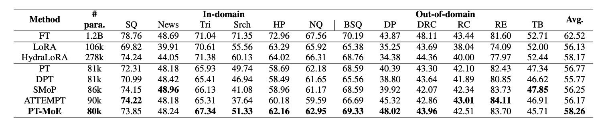
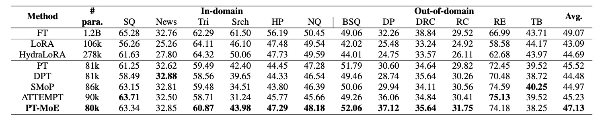
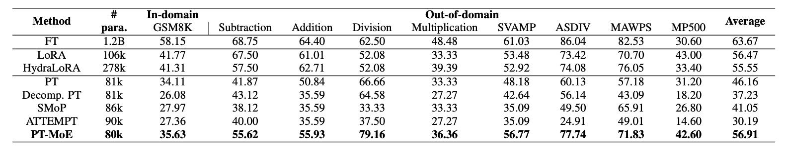

# PT-MoE: An Efficient Finetuning Framework for Integrating Mixture-of-Experts into Prompt Tuning

<p align="center">
  <b>Content</b>
</p>

<p align="center">
  <a href="#news">🚀 News</a> •
  <a href="#todo">✏️ Todo</a> •
  <a href="#introduction">✨ Introduction</a>
</p>

<p align="center">
  <a href="#environment">🖥️ Environment</a> •
  <a href="#inferencedemo">🤗 Inference Demo</a> •
  <a href="#finetuningdemo">🤗 Finetuning Demo</a>
</p>

<p align="center">
  <a href="#evaluation">✏️ Evaluation</a> •
  <a href="#results">🎲 Results</a>
</p>

<p align="center">
  <a href="#download">💾 Download</a> •
  <a href="#citation">📌 Citation</a> •
  <a href="#license">🔖 License</a>
</p>
<div id="news">&nbsp;</div>

<p align="center">
  <b>Links</b>
</p>

<p align="center">
  <a href="https://github.com/ZongqianLi/PT-MoE/blob/main/README.md">Project Page</a> •
  <a href="https://arxiv.org/abs/2505.09519">Paper</a>
</p>


## 🚀 News

- **[2025.05.15]** This page is created.

<div>&nbsp;</div>
<div>&nbsp;</div>
<div id="todo">&nbsp;</div>


## ✏️ Todo

- [ ] Upload the codes.
- [ ] Upload the models.

<div>&nbsp;</div>
<div>&nbsp;</div>
<div id="introduction">&nbsp;</div>


## ✨ Introduction

### Contributions

- **Novel finetuning framework:** We propose PT-MoE, integrating matrix decomposition with MoE for prompt tuning. Our framework achieves state-of-the-art performance with fewer parameters while outperforming either method alone, demonstrating their complementary benefits.
- **Design dynamics:** We thoroughly analyze key variables influencing the performance of PT-MoE, including prompt length, expert count, trainable parameters, routing mechanisms, and model size. Findings provide design guidelines for future parameter-efficient tuning approaches.
- **Comprehensive analysis:** We provide detailed empirical studies across diverse tasks, including QA and mathematical problem solving, establishing a basis for future work in efficient finetuning methods.

### Overview performance

Performance comparison of PEFT methods on 12 QA datasets in the MRQA benchmark (upper) and 5 math datasets (lower). ↑ indicates higher is better; ↓ indicates lower is better:

<p align="left">
  
</p>

### Architecture

Framework of PT-MoE. Each soft prompt is decomposed into an input-specific matrix $A_i$ and a shared matrix $B$, with a router adaptively selecting and combining prompt components based on input. The resulting soft prompt is prepended to the input for the frozen LLM:

<p align="left">
  
</p>

<div>&nbsp;</div>
<div>&nbsp;</div>
<div id="environment">&nbsp;</div>


## 🖥️ Environment

Please use the same environment:

```
python==3.11.5
torch==2.3.1+cu118
transformers==4.46.0
datasets==2.18.0
huggingface_hub==0.24.2
deepspeed==0.15.3
wandb==0.14.2
numpy==1.23.5
tqdm==4.66.4
```

<div>&nbsp;</div>
<div>&nbsp;</div>
<div id="inferencedemo">&nbsp;</div>


## 🤗 Inference Demo

### QA

### Math


<div>&nbsp;</div>
<div>&nbsp;</div>
<div id="finetuningdemo">&nbsp;</div>


## 🤗 Finetuning Demo

### QA


### Math


<div>&nbsp;</div>
<div>&nbsp;</div>
<div id="evaluation">&nbsp;</div>


## ✏️ Evaluation

### QA

### Math


<div>&nbsp;</div>
<div>&nbsp;</div>
<div id="results">&nbsp;</div>


## 🎲 Results

### QA

Evaluation results (F1 scores) for various PEFT methods on MRQA datasets. SQ: SQuAD; News: NewsQA; Tri: TriviaQA; Srch: SearchQA; HP: HotpotQA; NQ: NaturalQuestions; BSQ: BioASQ; DP: DROP; DRC: DuoRC; RC: RACE; RE: RelationExtraction; TB: TextbookQA. The bold values indicate the best performance among prompt tuning-based methods:

<p align="left">
  
</p>

Evaluation results (Exact Match) for MRQA datasets:

<p align="left">
  
</p>

### Math

Accuracy (\%) on mathematical problem-solving tasks with the number of trainable parameters shown in the second column. The first four out-of-domain datasets are from the SVAMP dataset. MP500 denotes the first 500 questions from MATH\_PROBLEMS:

<p align="left">
  
</p>

<div>&nbsp;</div>
<div>&nbsp;</div>
<div id="download">&nbsp;</div>


## 💾 Download

- [PT-MoE for QA based on llama-3.2-1b-it]()
- [PT-MoE for math based on llama-3.2-1b-it]()
- [PT-MoE for math based on llama-3.2-3b-it]() 

<div>&nbsp;</div>
<div>&nbsp;</div>
<div id="citation">&nbsp;</div>


## 📌 Citation

```
@misc{li2025ptmoeefficientfinetuningframework,
      title={PT-MoE: An Efficient Finetuning Framework for Integrating Mixture-of-Experts into Prompt Tuning}, 
      author={Zongqian Li and Yixuan Su and Nigel Collier},
      year={2025},
      eprint={2505.09519},
      archivePrefix={arXiv},
      primaryClass={cs.CL},
      url={https://arxiv.org/abs/2505.09519}, 
}
```

<div>&nbsp;</div>
<div>&nbsp;</div>
<div id="license">&nbsp;</div>


## 🔖 License

```

```


